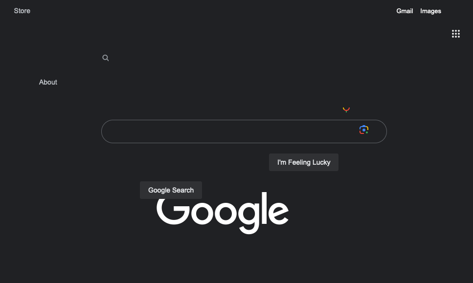
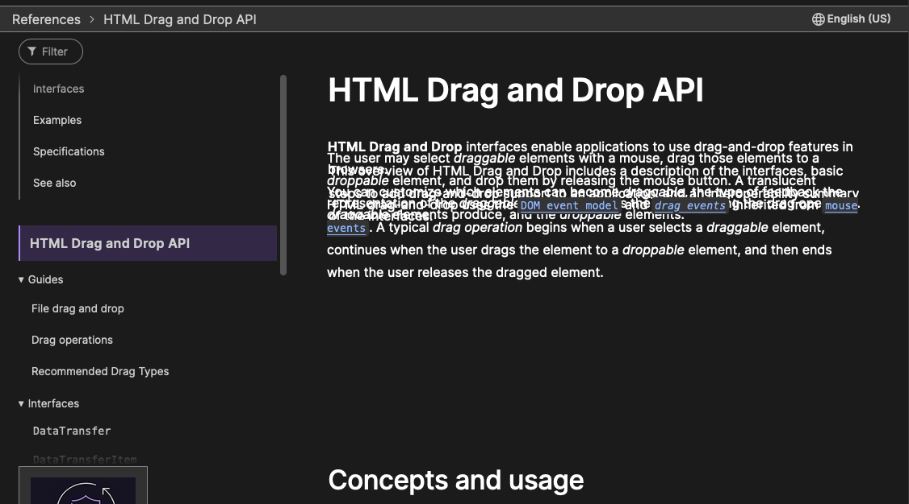

# with great power...

...comes great responsibility.

this firefox browser extension lets you rearrange website elements to your liking by dragging them around.

---

google's homepage too clean and minimalist for you? fix it yourself!

not enough time to scroll through all of Mozilla's documentation? read it all at the same time!

beware, these changes will stick around even after you reload. (but that's obviously a good thing)

---
made for [creative coding](https://creativecoding.recurse.com/) at [the recurse center](https://www.recurse.com/) with @reedspool